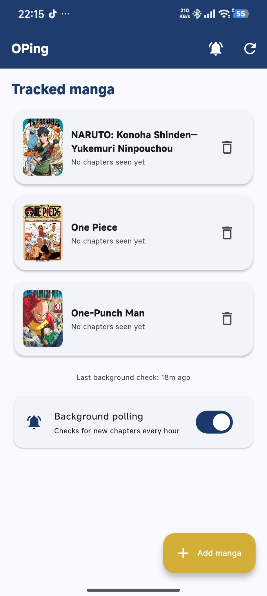

# OPing

Android app that lets you track any MangaDex manga and sends a local notification whenever a new chapter drops — no backend, no Firebase, completely free.

<p align="center">
  
</p>

## Features

- Search MangaDex by title and subscribe to any manga from the catalogue
- Polls MangaDex once per hour in the background via WorkManager — a single batched API call covers all tracked manga
- Local push notification per new chapter; combined summary notification when multiple manga update at once
- Manual "check now" button in the AppBar for instant on-demand checks
- Toggle to pause/resume background polling
- Zero cost: no server, no cloud functions, no subscriptions

## Requirements

- Android 8.0+ (API 26)
- Internet connection

---

## Setup

### Linux

```bash
# 1. Flutter SDK
mkdir -p ~/development && cd ~/development
sudo snap install flutter --classic
# or: download from https://docs.flutter.dev/get-started/install/linux and extract here

# 2. Add to ~/.bashrc or ~/.zshrc
echo 'export ANDROID_HOME="$HOME/Android/Sdk"' >> ~/.zshrc
echo 'export PATH="$HOME/development/flutter/bin:$ANDROID_HOME/cmdline-tools/latest/bin:$ANDROID_HOME/platform-tools:$PATH"' >> ~/.zshrc
source ~/.zshrc

# 3. Android command-line tools
# Download "Command line tools only" from https://developer.android.com/studio#command-line-tools-only
mkdir -p ~/Android/Sdk/cmdline-tools/latest
unzip commandlinetools-linux-*.zip -d ~/Android/Sdk/cmdline-tools/latest --strip-components=1

sdkmanager --licenses
sdkmanager "platform-tools" "platforms;android-34" "build-tools;34.0.0"

# 4. Verify
flutter doctor
```

### Windows

```powershell
# 1. Flutter SDK (via winget)
winget install Google.FlutterSDK
# Restart terminal, then verify:
flutter --version

# 2. Android SDK — install Android Studio (bundles the SDK)
winget install Google.AndroidStudio
# Or "Command line tools only" from https://developer.android.com/studio#command-line-tools-only
# Extract to %LOCALAPPDATA%\Android\Sdk\cmdline-tools\latest\

# 3. Set ANDROID_HOME (run once in PowerShell as admin)
[Environment]::SetEnvironmentVariable("ANDROID_HOME", "$env:LOCALAPPDATA\Android\Sdk", "User")
$path = [Environment]::GetEnvironmentVariable("PATH", "User")
[Environment]::SetEnvironmentVariable("PATH", "$path;$env:LOCALAPPDATA\Android\Sdk\platform-tools", "User")
# Restart terminal

sdkmanager --licenses
sdkmanager "platform-tools" "platforms;android-34" "build-tools;34.0.0"

# 4. Verify
flutter doctor
```

### WSL2 note

Android emulators do not run inside WSL2. Use a physical device over Wi-Fi:

```bash
# On the phone: Settings → Developer Options → Wireless debugging → Pair device with pairing code
flutter devices   # confirm device appears
flutter run
```

---

## Run & Build

```bash
git clone https://github.com/guilhermeleitao2002/OPing.git
cd OPing
flutter pub get

flutter run                     # debug on connected device
flutter test                    # unit tests (no device needed)
flutter test integration_test/  # integration tests (device required)
flutter build apk --release     # signed release APK → build/app/outputs/flutter-apk/
```

---

## Architecture

```
App launch
  ├── migrateLegacyOnePieceSubscription()  — one-shot, idempotent
  ├── NotificationService.initialize()
  └── Workmanager.registerPeriodicTask() — hourly background job

Background isolate (every ~1 hour, WorkManager)
  └── WorkerTask.execute()
        ├── TrackedMangaService.getAll()
        ├── MangaDexService.fetchLatestChaptersFor([ids])  ← single batched GET /chapter
        └── for each manga where latest > lastSeen
              ├── show single or combined notification
              └── TrackedMangaService.updateLastSeen()
```

Data source: MangaDex public REST API — anonymous, no auth required. Search hits `GET /manga`; chapter polling hits `GET /chapter` with `manga[]=…` to fetch every tracked manga in one request.

```
lib/
├── main.dart
├── models/
│   ├── chapter.dart
│   └── manga.dart
├── services/
│   ├── manga_dex_service.dart
│   ├── chapter_storage_service.dart
│   ├── tracked_manga_service.dart
│   └── notification_service.dart
├── workers/chapter_check_worker.dart
├── screens/
│   ├── home_screen.dart
│   └── manga_search_screen.dart
└── widgets/manga_card.dart
```

---

## Release signing

The keystore and `android/key.properties` are excluded from the repo. To sign your own build:

```bash
keytool -genkeypair -alias oping -keyalg RSA -keysize 2048 -validity 10000 \
  -keystore android/app/oping-release.jks \
  -dname "CN=Your Name, O=YourOrg, C=US" \
  -storepass <password> -keypass <password>
```

Create `android/key.properties`:
```
storePassword=<password>
keyPassword=<password>
keyAlias=oping
storeFile=oping-release.jks
```
